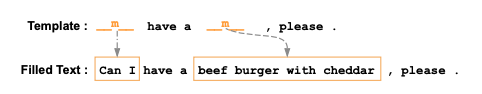
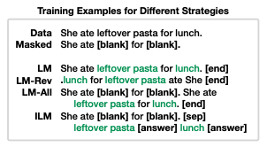

```{r setup, include=FALSE}
knitr::opts_chunk$set(echo = TRUE)
```

## MaskGAN: Better text generation via filling in the ________

Published date: March 1, 2018

Authors: William Fedus, Ian Goodfellow and Andrew M. Dai 

Affiliation: Google Brain 

URL: https://arxiv.org/pdf/1801.07736.pdf

### Background

At the time where the paper was published, text generation techniques with the best results were commonly built on Recurrent Neural Networks (RNNs). In this paper, the authors proposed a new framework that involves the usage of Generative Adversarial Networks (GANs) (Goodfellow et al., 2014). GAN is a framework for training generative models in an adversarial setup that consists of a discriminator and a generator, where the model learns from the competition between the discriminator and the generator. GAN is widely used in image generation. In this paper, the authors applied the GAN model in the context of natural language to achieve text generation.

### How it works
According to the paper, GANs commonly suffer from issues such as training instability and mode dropping, both are exacerbated in a textual setting due to the discrete nature of text. The authors reduce the impact of these problems by training the model on a text in-filing task. In this task, portions of a body of text are deleted or redacted, and the model aims to infill the missing portions of text to be indistinguishable from the original data in an autoregressive manner.
 
The network is trained by the task of text-infilling using the sequence-to-sequence (Seq2Seq) architecture (Sutskever et al., 2014) for both the generator and the discriminator. During the training process, the encoder of the generator produces the context representation using the masked sequence. The discriminator then conditions on the generator’s output and the masked sequence to compute the probability of a word in the generator’s output as being fake or real. If one wishes to do text-generation instead of text-infilling, it can be done by setting all inputs to be blanks (masked).

### Limitations
 
* According to one reviewer on OpenReview: “because the model aims to fill-in blanks from the text around (up to that time), generated texts are generally locally valid but not always valid globally.”

* Another reviewer raised the concern of the model performance.

* As pointed out by the paper Enabling text infilling by language models: “While their approach is effective at infilling individual words, it is somewhat redundant as the model must “predict” the unmasked text in $\tilde{x}$. Additionally, a model is not guaranteed to exactly reproduce the unmasked text.”

### Other notes

* One of the authors, Goodfellow, is the person who co-invented GAN.

## Text Infilling

Published date: January 18, 2019

Authors: Wanrong Zhu, Zhiting Hu, Eric P. Xing 

Affiliation: Peking University, Carnegie Mellon University, Petuum Inc. 

URL: https://arxiv.org/pdf/1901.00158.pdf

### Background

This paper proposes an approach to achieve text-infilling tasks based on several representative solutions, including RNN with sequence-to-sequence (Seq2Seq) (Bahdanau et al., 2014), a GAN-based model (Goodfellow et al., 2014), and a self-attention method (Vaswani et al., 2017). The authors concluded that the self-attention method has the best performance for the text-infilling task. Compared to MaskGAN, the main breakthrough of the approach is its ability to generate unconstraining length of words in one blank gap. The proposed approach aims to fill the missing portions based on the global and surrounding context, to make the text complete and meaningful. 

See the example given by the paper, where there are six words inserted in the two blanks:




### How it works

In the training process, the authors randomly sample sentences from the training corpus and blank out words with different strategies (taking out prepositions and articles, keeping only achor words...etc). For each input, the number of blanks and their positions are known, but the number of tokens to be filled in each blank is not known. A model must decide by itself how many tokens to generate for a blank. With this approach, the model learns to produce in-filling results that does not restrict to a single word. 

### Limitations

* According to a reviewer on Open Review: “the size of the data set is far from sufficient. Unless the authors are trying to show that the transformer is more data-efficient (which is doubtful), the dataset needs to be much larger than the 1M token it appears to be now. The size of the vocabularies is also far from being representative of any real-world setting.”

* As pointed out by the paper Enable text-infilling by language models”: “this approach relies on specialized architecture and hence cannot easily leverage large-scale pre-trained models.”

### Other notes

* The table provides the comparison of different approaches. Golden is the original data. The approach that uses self-attention has the best meaningful result.

* Self-attention mechanism is what Transformer architecture is based on.

## XL-Editor: Post-editing Sentences with XLNet

Published date: October 19, 2019

Authors: Yong-Siang Shih, Wei-Cheng Chang, Yiming Yang

Affiliation: Carnegie Mellon University

URL: https://arxiv.org/pdf/1910.10479.pdf

### Background

This paper proposed a novel training framework for XLNet (Yang et al. 2019) to execute operation of post-editing of text data. The extension of XLNet called XLEditor, was then created to perform text post-editing operations such as insertion, deletion, and replacement. While the paper aims to perform text editing, text in-filling is one of the tasks the model was trained to do. Created in 2019, XLNet is a new pre-trained language model based on the Transformer architecture with recurrence. According to the authors, XLNet outperforms other Transformer-based language models including GPT-2 from OpenAI and BERT from Google. The authors examined the capability of XLEditor by three tasks: including Locate (which position to insert), Text Infilling (what tokens to be inserted), and Text Deletion (what tokens to be deleted). The author also claimed that XLEditor outperforms XLNet in the above tasks.

### How it works

According to the authors, the heart of the XL-Editor model is to estimate the variable length insertion probability for the post-editing process. Still working to understand the meaning of this claim. The training method for the three tasks for post-editing are as follows: 

Locate task: In the training sentences for locating the need of text insertion, a randomly selected subsequence is deleted. The model is given 5 positions and is asked to decide which position to perform text insertion.

Text infilling task: Text infilling task is built upon the work of (Zhu, Hu, and Xing 2019; Liu et al. 2019). The improvement provided by the authors was to provide more context in the training to restrict the possibilities of plausible insertions. 

Text deletion: In each training example for text deletion task, there are five consecutive sentences sampled from the testing articles. One of the three sentences in the middle is sampled from a different article and is to be removed for text coherence. The model is asked to decide which sentence is not coherent with the rest.

### Limitations

Limitations are not discussed in the paper, not found in other papers, and public reviews on open reviewers are not found.

### Other notes

Now made as a desktop application: https://www.xldevelopment.net/editor.php

## Enabling Language Models to Fill in the Blanks

Published date: September 10, 2020

Authors: Chris Donahue, Mina Lee, Percy Liang

Affiliation: Stanford University

URL: https://arxiv.org/pdf/2005.05339.pdf

### Background

In this paper, the authors present a simple framework that enables language models to infill variable-length spans called infilling by language modeling (ILM). The authors claimed that the framework is model-agnostic, which means it can be applied to any existing language models. Moreover, the framework performs better with pre-trained language models instead of training from scratch. Their best result presented in the paper was from fine-tuning GPT-2.

### How it works

There are four different training strategies they employed for the experiment.  LM considers only the left context while LM-Rev only considers the right. LM-All considers context on both sides but uses long sequence lengths. ILM, which is the proposed model, considers context from both directions with fewer tokens.

What’s valuable about the paper is that it demonstrates how to prepare training data for fine-tuning the language model (GPT-2 in their case), which is a knowledge we didn’t have in the summer. To produce an infilling example, a number of random spans in a sentence were replaced with [blank] tokens. The masked sentence, the separation token ([sep]), and the answers are then concatenated to be one example. The following screenshot is the training examples for different strategies they employed: 



\newpage

After the model is trained, the model takes text input with blanks, predicts the answers, and then merges them as one sentence to produce the output. For example:

  > She ate [blank] for [blank] + leftover pasta [answer] lunch [answer] =
  > She ate leftover pasta for lunch 

### Limitations

Limitations are not discussed in the paper, not found in other papers, and public reviews on open reviewers are not found.

### Other notes

None


